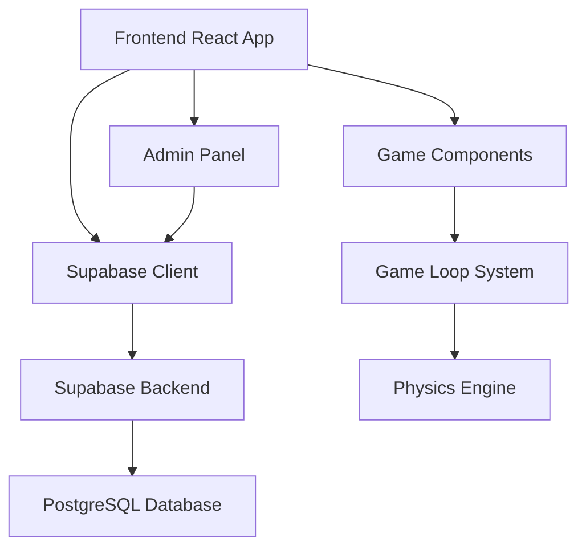
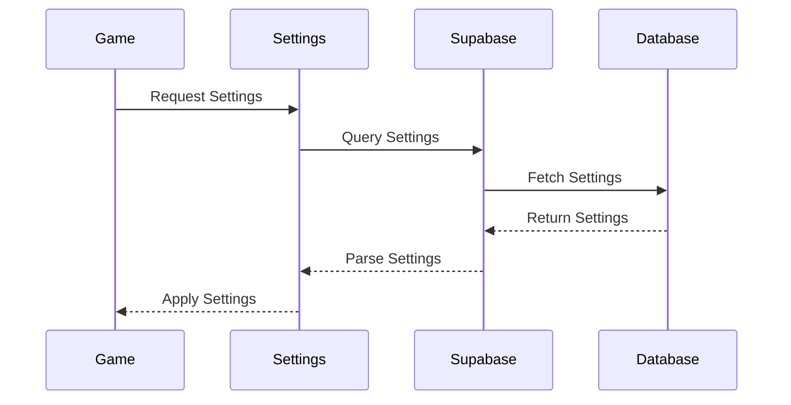
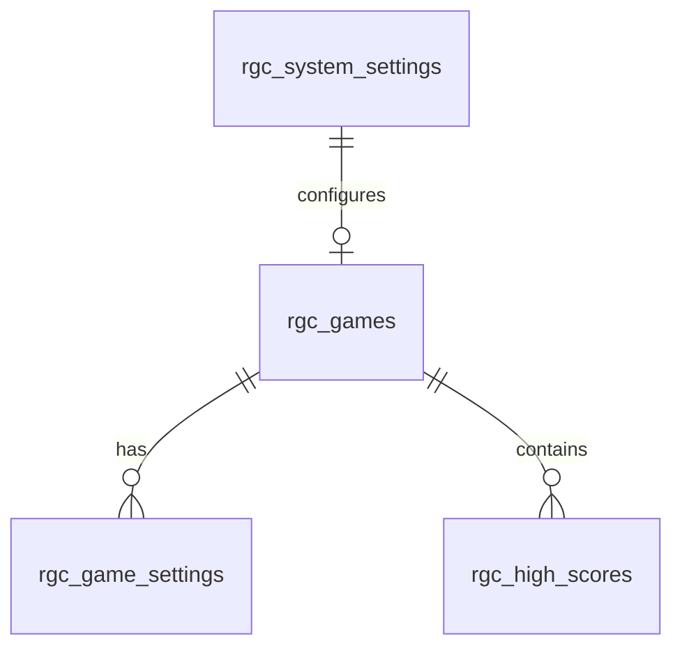
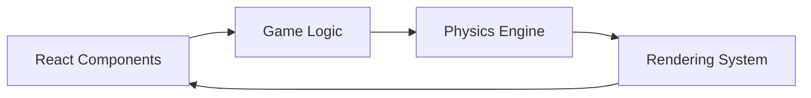
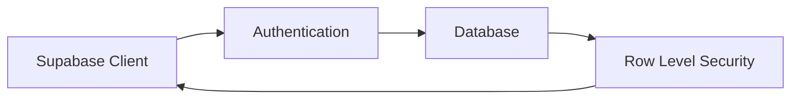

# Game Center System Integration Guide

## System Architecture Overview

The Game Center is built on several interconnected systems that work together to provide a seamless gaming experience. Here's how each system integrates with the others:



## Core Systems Integration

### 1. Frontend to Backend Communication

The React frontend communicates with Supabase through the client instance:

```typescript
// src/lib/supabase.ts
export const supabase = createClient<Database>(supabaseUrl, supabaseKey);

// Usage in components
const { data, error } = await supabase
  .from('rgc_games')
  .select('*');
```

Key Integration Points:
- Environment variables connect frontend to Supabase
- TypeScript types ensure type safety
- Real-time subscriptions maintain data sync
- Error handling propagates through layers

### 2. Game Engine Integration

Each game integrates with the core system through:

```typescript
// Game Component Integration
export function Game() {
  // Settings Integration
  const [settings, setSettings] = useState(DEFAULT_SETTINGS);
  
  // Database Integration
  useEffect(() => {
    loadSettings();
  }, []);
  
  // Game Loop Integration
  useEffect(() => {
    if (gameStarted) {
      const gameLoop = requestAnimationFrame(update);
      return () => cancelAnimationFrame(gameLoop);
    }
  }, [gameStarted]);
}
```

### 3. Settings Management Flow



## System-by-System Breakdown

### 1. Authentication System

```typescript
// Authentication Flow
async function handleAuth() {
  const { data: { user }, error } = await supabase.auth.signIn({
    email,
    password
  });
  
  if (user) {
    // Check admin status
    const { data: profile } = await supabase
      .from('profiles')
      .select('role')
      .eq('id', user.id)
      .single();
      
    return profile?.role === 'admin';
  }
}
```

### 2. Game State Management

```typescript
// Game State Integration
function GameStateManager() {
  // Core state
  const [gameState, setGameState] = useState({
    started: false,
    paused: false,
    score: 0
  });
  
  // Database integration
  async function saveScore() {
    await supabase
      .from('rgc_high_scores')
      .insert({
        score: gameState.score,
        user_id: currentUser.id
      });
  }
}
```

### 3. Settings System

The settings system provides a unified interface for both game-specific and system-wide settings:

```typescript
// Settings Integration
interface SettingsManager {
  // Game settings
  loadGameSettings: (gameSlug: string) => Promise<void>;
  updateGameSetting: (key: string, value: any) => Promise<void>;
  
  // System settings
  loadSystemSettings: () => Promise<void>;
  updateSystemSetting: (key: string, value: any) => Promise<void>;
}
```

### 4. Database Schema Integration



### 5. Component Communication

Components communicate through:
1. Props for direct parent-child communication
2. Context for global state management
3. Database for persistent state
4. Events for cross-component messaging

```typescript
// Component Integration Example
function GameComponent({ onScore, onGameOver }) {
  // Local state
  const [state, setState] = useState();
  
  // Context usage
  const settings = useSettings();
  
  // Database integration
  const { data } = useSupabaseQuery();
  
  // Event handling
  useEffect(() => {
    const handler = (e) => handleEvent(e);
    window.addEventListener('gameEvent', handler);
    return () => window.removeEventListener('gameEvent', handler);
  }, []);
}
```

## System Integration Points

### 1. Frontend Integration



### 2. Backend Integration



### 3. Game Loop Integration

```typescript
// Game Loop System
function GameLoop() {
  // Physics update
  function updatePhysics() {
    applyGravity();
    checkCollisions();
    updatePositions();
  }
  
  // Render update
  function updateRender() {
    clearCanvas();
    drawBackground();
    drawEntities();
    drawUI();
  }
  
  // Main loop
  function loop() {
    updatePhysics();
    updateRender();
    requestAnimationFrame(loop);
  }
}
```

## Cross-Cutting Concerns

### 1. Error Handling

Errors are handled consistently across systems:

```typescript
try {
  // Operation
} catch (error) {
  // Log error
  console.error('System Error:', error);
  
  // User feedback
  notifyUser(error.message);
  
  // State recovery
  resetState();
  
  // Error reporting
  reportError(error);
}
```

### 2. Performance Optimization

Systems are optimized through:
1. Efficient data structures
2. Memoization
3. Debouncing
4. Resource pooling
5. Lazy loading

### 3. Security Integration

Security is enforced at multiple levels:
1. Frontend validation
2. API authentication
3. Row Level Security
4. Data sanitization

## System Monitoring

### 1. Performance Monitoring

```typescript
// Performance tracking
const startTime = performance.now();

// Operation
doOperation();

// Log performance
console.log(`Operation took: ${performance.now() - startTime}ms`);
```

### 2. Error Monitoring

```typescript
// Error tracking
window.onerror = function(message, source, lineno, colno, error) {
  // Log error
  console.error('Global Error:', {
    message,
    source,
    lineno,
    colno,
    error
  });
  
  // Report error
  reportError(error);
  
  return false;
};
```

## System Testing

### 1. Integration Testing

```typescript
describe('System Integration', () => {
  it('should load game settings', async () => {
    const game = new Game();
    await game.loadSettings();
    expect(game.settings).toBeDefined();
  });
});
```

### 2. Performance Testing

```typescript
describe('Performance', () => {
  it('should maintain 60fps', () => {
    const game = new Game();
    const frames = measureFrameRate(game);
    expect(frames).toBeGreaterThanOrEqual(60);
  });
});
```

## Deployment Integration

The system is deployed through Netlify with:
1. Automatic builds
2. Environment variable management
3. Redirect handling
4. SSL/TLS security
5. CDN distribution

## Additional Resources

- [Game Center Documentation](game-center.md)
- [Admin Guide](admin.md)
- [User Guide](user.md)
- [Getting Started](getting-started.md)
- [Duplicate in Bolt](https://bolt.new/?rid=ec8szn)